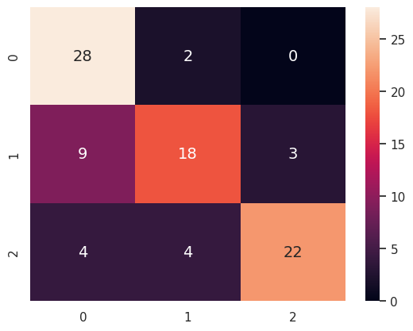

## Accessory Recognizer Telgram-bot
 developing a recognizer with CNN deep learning algorithm using tensorflow. developing a bot that can recognize the category of your accessories based on a categorized dataset.
 this is the <a href='http://t.me/Bot_accr_bot'> bot link</a>.
- categories are:
  - sunglasses
  - shoes
  - watch

|                      | Loss               | Accuracy          |
| :------------------: | :----------------: | :---------------: |
| Train                |  0.60              |71%          |
| Validation           |  0.71              |   76%          |
| Test                 |  0.58              |   77%          |

 

- datas gathered with a <a href='https://github.com/SajjadAemmi/Pinterest-Crawler'>pinterest crawler</a> developed by my mentor <a href='https://github.com/SajjadAemmi'>Sajjad Aemmi</a>.

 

- Confusion Matrix:
>  

 

- inferences shared on wandb.ai:
  - <a href='https://wandb.ai/matin-samvatian/accessories-recognizer/'>accessories-recognizer</a>