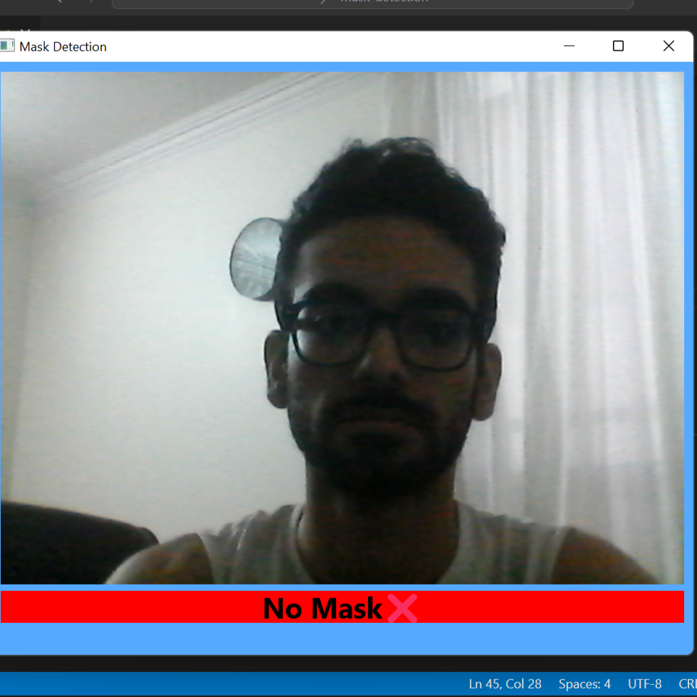

## Mask Detection
Mask detection using Tensoflow framework and MobileNetV2 by training on <a href='https://www.kaggle.com/datasets/ashishjangra27/face-mask-12k-images-dataset'>Mask dataset from kaggle</a>.

- run the inference file to see the UI written by QT.

> 

> 

|  MobileNetV2              | Loss               | Accuracy          |
| :------------------: | :----------------: | :---------------: |
| Train                |  0.08              |   99%          |
| Validation           |  0.01              |   98%          |
| Test                 |  0.08              |95%  