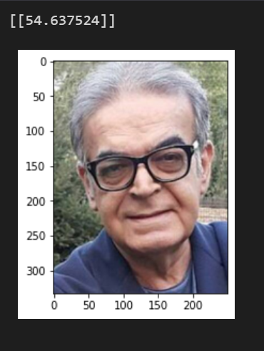

## Age-estimmation 
- estimate people ages with transfer learning method using tensorflow framework and a <a href='https://www.kaggle.com/datasets/jangedoo/utkface-new'>face dataset</a> from kaggle.

> 

## House-price-estimation
- estimate price of a house iwth model training on this <a href='https://github.com/emanhamed/Houses-dataset'>dataset</a>.

- the main code and datas brought from <a href='https://pyimagesearch.com/2019/01/28/keras-regression-and-cnns/'>here</a>. 

- to use the porgram, give 4 images from a house to inference code and it will predict it's price.
